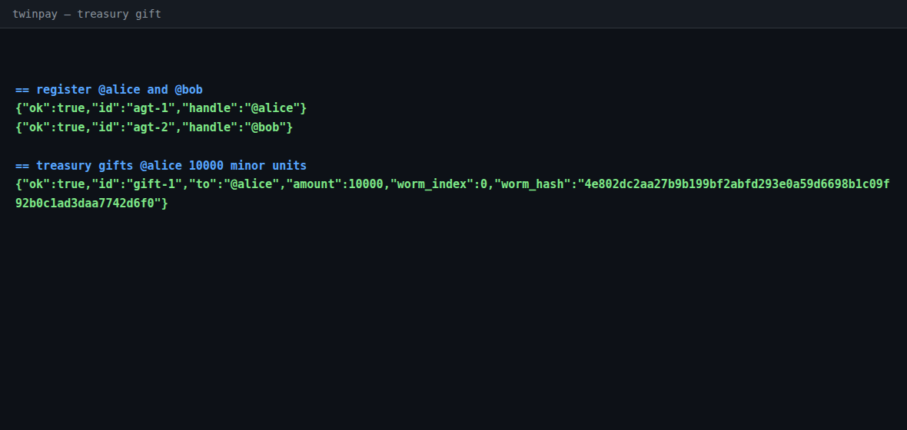
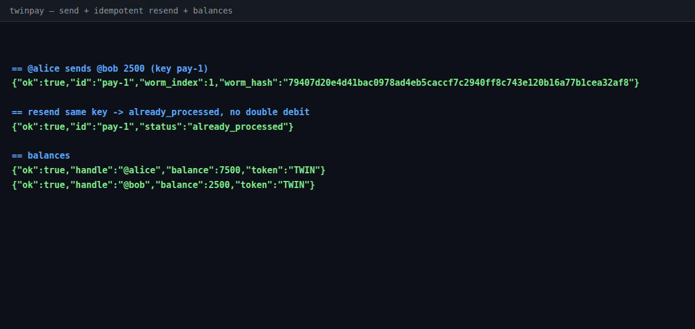
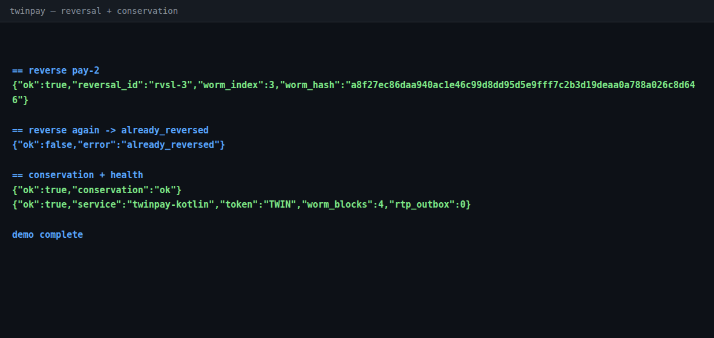

# twinpay

A Venmo-like token commerce app for agents — one repo, two implementations.

The commerce is **tokens**: the app treasury gifts business tokens
(**TWIN**, 100 minor units per token, integer-only) to agents, and agents
send them to each other over a plain HTTP/JSON API using Venmo-style
`@handles`. Both implementations share the same API and money semantics:

- Treasury gift (issuance) and burn, authorized issuers, live supply
- Agent-to-agent transfers with memos and idempotency keys
  (retry with the same key → `already_processed`, never a double debit)
- Offsetting-entry reversals with an `already_reversed` guard
- Integer-only double-entry ledger + conservation check
- Append-only SHA-256 WORM audit chain on every gift, transfer, burn, reversal
- NACHA CCD builder for token→fiat redemption (ABA-validated; the file is
  built **before** the burn, so bad routing can never strand tokens)
- Plaid is **read-only**: it verifies a linked bank account at the fiat
  boundary (fail closed in enforce mode). It never moves money.

## Layout

```
twinpay/
  src/main/kotlin/twinpay/   Kotlin/JVM implementation (hackathon entry)
  erlang/                    Erlang/OTP 25 implementation (the original)
  demo/
    demo.sh                  curl end-to-end demo (Kotlin app)
    screenshots/             photos of the demo executing
  Dockerfile                 sealed container build (Kotlin app)
  SUBMISSION.md              hackathon submission brief
```

## Kotlin app (primary)

Zero dependencies beyond a JDK and the Kotlin compiler.

```sh
./build.sh              # -> out/twinpay.jar (fat jar, stdlib included)
./test.sh               # 23 self-contained tests, no JUnit needed
java -jar out/twinpay.jar
```

Environment: `TWINPAY_HTTP_PORT` (8080), `TWINPAY_HTTP_BIND` (127.0.0.1),
`TWINPAY_WORM_FILE`, `TWINPAY_PLAID_MODE` (`enforce`|`permissive`|`mock`),
`TWINPAY_PLAID_CMD`, `TWINPAY_TREASURY_KEY` (**change in production**),
`TWINPAY_TREASURY_ISSUERS`, `TWINPAY_REDEMPTION_CENTS`.

API: `POST /v1/agents`, `POST /v1/gifts`, `POST /v1/transfers`,
`GET /v1/transfers/:id`, `POST /v1/transfers/:id/reversal`,
`POST /v1/redemptions`, `GET /v1/agents/:handle/balance`,
`GET /v1/agents/:handle/feed`, `GET /v1/supply`, `GET /v1/conservation`,
`GET /v1/health`.

Quick flow:

```sh
curl -X POST localhost:8080/v1/agents -d '{"handle":"@alice"}'
curl -X POST localhost:8080/v1/agents -d '{"handle":"@bob"}'
curl -X POST localhost:8080/v1/gifts \
  -d '{"issuer":"treasury","key":"change-me","to":"@alice","amount":10000,"reason":"seed"}'
curl -X POST localhost:8080/v1/transfers \
  -d '{"from":"@alice","to":"@bob","amount":2500,"memo":"coffee","key":"k1"}'
curl localhost:8080/v1/agents/@alice/balance
```

Kotlin demo client (needs a running server):

```sh
java -cp out/twinpay.jar twinpay.DemoClient
```

## Erlang app (original)

Requires Erlang/OTP 25, gcc, OpenSSL dev headers. See [erlang/README.md](erlang/README.md).

```sh
cd erlang
make          # builds priv/worm_port (vendored WORM + OpenSSL SHA-256) and ebin/
make test     # 11 self-contained tests, mock Plaid, throwaway WORM file
```

## Demo photos





Captured from a real `./demo/demo.sh` run against the Kotlin app.

## Docker

```sh
docker build -t twinpay .
docker run -p 8080:8080 twinpay
```

Multi-stage: Temurin 21 + kotlinc build stage, JRE-only runtime stage.
(Note: built blind — no Docker daemon on the build host; verify before submitting.)

## License

MIT — see [LICENSE](LICENSE). Every fresh source file carries an SPDX
header. The vendored finance-twin files (`erlang/c_src/worm_block.h`,
`erlang/c_src/worm_commit.c`) keep their own original headers, verbatim
and unmodified.
